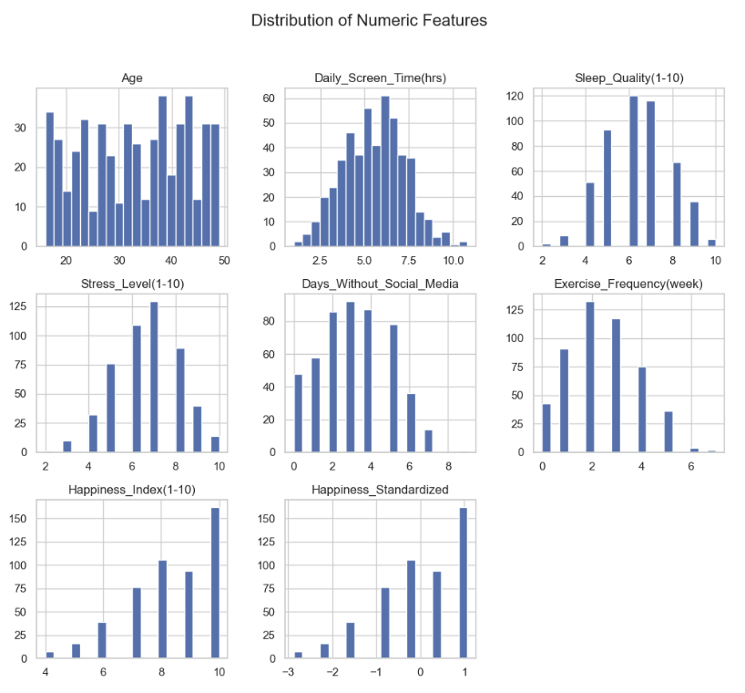
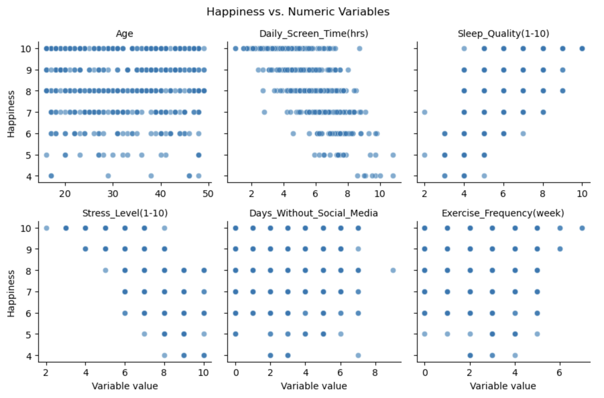
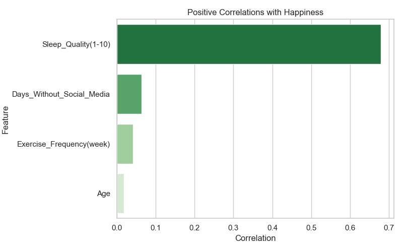
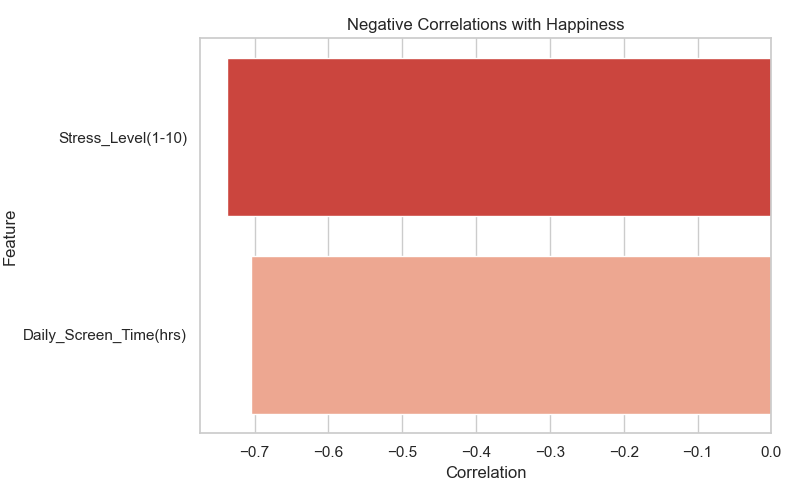
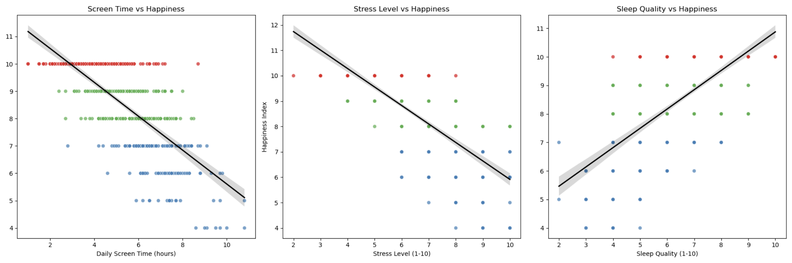
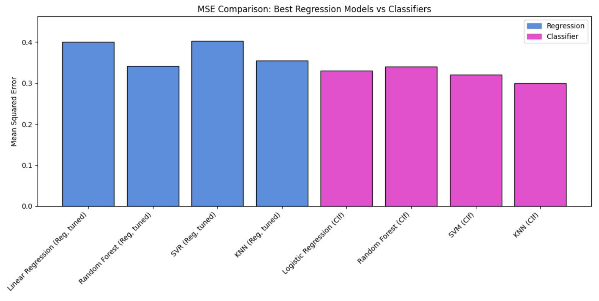
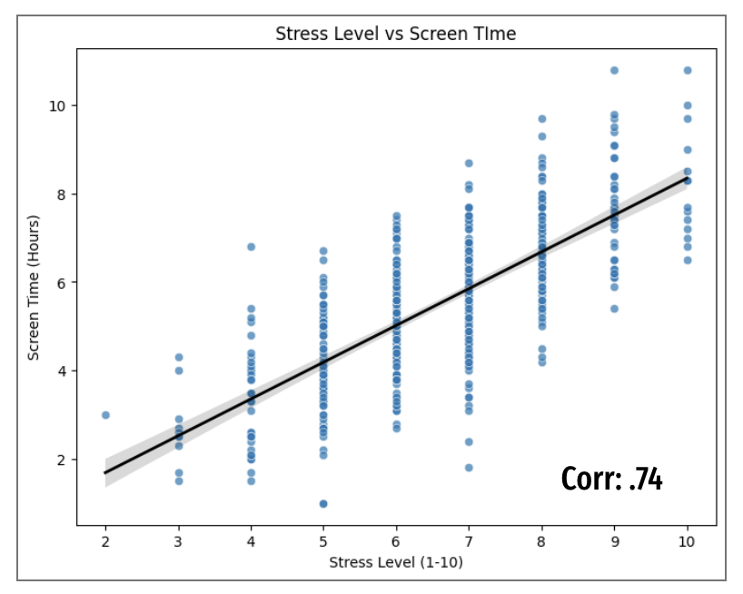
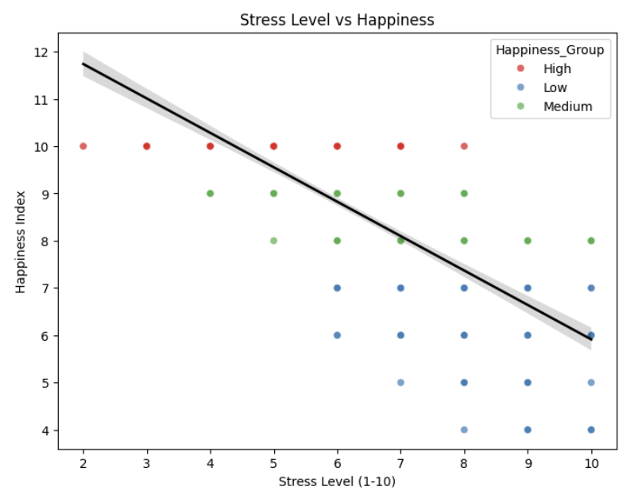

# Happiness & Social Media Usage Analysis

# Stuff to be added

# Confidence interval explanation
The shaded band around the regression line represents the model’s confidence interval, showing the range of regression lines that are statistically plausible given our data. This interval reflects uncertainty in the estimated line, not the variability of individual observations.

# Investigating non-linearity
To evaluate whether our predictor variables (screen time, sleep quality, and stress level) relate to happiness in a linear or nonlinear way, we compared linear, quadratic, and cubic regression models. Across all variables, the quadratic model consistently improved model fit compared to the linear model, suggesting that the relationships are not perfectly linear. For screen time and sleep quality, the gains from quadratic models were modest, and cubic models actually performed worse- indicating that while some curvature exists, the underlying relationships remain relatively simple and are not strongly nonlinear. In contrast, stress level showed a clearer nonlinearity: both quadratic and cubic models improved the R² substantially, with the cubic model performing best. This suggests that the effect of stress on happiness may involve threshold or accelerating patterns that a linear model cannot fully capture. Overall, our results show that while linear trends exist, incorporating mild nonlinearity provides a more accurate representation of how these lifestyle factors relate to happiness, especially in the case of stress. These results are consistent with our suspicion that there are aspects of non-linearity in the relationships between our predictor variables and happiness. 

## Introduction

Our project focuses on social media usage and how it can affect happiness and mental health. The rapid growth of social media platforms has significantly transformed the way individuals communicate, share information, and interact with the world. As daily screen time and online engagement continue to rise, concerns have emerged about the potential impact of social media usage on mental health and overall happiness. The increasing use of social media has been identified as contributing to an increase in mental health challenges. [1] Analyzing trends between happiness and social media usage informs healthier platform design and better strategies for safe, balanced use. In this project, we apply machine learning methods to analyze lifestyle and social media–related variables and examine their relationship to a happiness score. Our goal is to build a predictive model that estimates an individual’s happiness and identifies which usage behaviors and factors are most strongly associated with high or low mental well-being.

## Data

The dataset for this analysis comes from Kaggle as tidy data. [4] Each row represents an individual, and the columns represent their lifestyle and media habits. The variables used in the analysis are _Daily Screen Time_, _Stress Level_, and _Sleep Quality_. We selected these variables for the analysis because our exploratory data analysis showed us that these variables have the highest correlation to our happiness index. We also determined that screen time would be the most significant variable in the analysis. The outcome variable that we are using is _Happiness Index_, a numerical variable dictating the overall happiness of the individual, and representing well-being, based on a self-reported score. We scaled all of the numerical variables in the analysis so that all the factors would contribute evenly to training the models. We also created a scaled, binned version of _Happiness Index_ which places each score into either Low, Medium, or High.

<table>
  <tr>
    <td>
      
    </td>
    <td>
      
    </td>
  </tr>
</table>

### Exploratory Data Analysis

To begin our exploratory data analysis, we examined the overall distribution of the key mental health–related variables in the dataset. We plotted histograms for all numerical features, including happiness, stress, sleep quality, exercise frequency, and daily screen time. These distribution plots helped us quickly identify several patterns across the data. Some variables, such as sleep quality and stress, are fairly balanced, while others, like days without social media, are heavily skewed, indicating that people rarely take breaks from social media platforms. Happiness scores also show noticeable clustering toward the middle and higher ranges of the scale.

Next, we examined the correlation matrix to better understand how these variables relate to one another. Stress and happiness show a clear negative correlation, while sleep quality and happiness display a positive relationship, as expected. Interestingly, daily screen time also shows a consistent negative correlation with happiness, although the relationship does not appear to be perfectly linear. Together, these correlations provide an initial view into how emotional, behavioral, and lifestyle factors interact within the dataset.

Overall, these visualizations give a high-level picture of the behavioral patterns and emotional responses represented in the data. To explore one of these relationships more closely, we next examined the connection between daily screen time and happiness. We standardized the happiness index so that differences could be measured on the same scale and plotted screen time against standardized happiness values. This visualization revealed a clear downward trend, indicating that higher amounts of daily screen usage are generally associated with lower happiness scores. The regression line further reinforces this negative relationship.

While the decline is not perfectly linear, the pattern suggests that screen time functions as a meaningful predictor of happiness, particularly when considered alongside other behavioral and lifestyle variables. This relationship becomes even more pronounced when incorporating stress and sleep quality into the analysis. The correlation results highlight three key drivers of happiness: sleep quality, which is one of the strongest positive predictors; stress level, which is one of the strongest negative predictors; and daily screen time, which consistently shows a negative relationship with happiness.

Although the effect of screen time is weaker than that of stress or sleep quality, it still plays a meaningful role. Screen time appears to act as a behavioral amplifier—intensifying the emotional effects of stress and reducing the benefits of quality sleep. Together, these variables form the foundation for the predictive models and cluster analysis used in later stages of the project.

<table><tr><td></td><td></td></tr></table>

## Methods

We applied several machine learning techniques to analyze the relationship between social media–related variables and a happiness index using multiple modeling approaches. Our analysis considered happiness both as a categorical and a numerical variable to evaluate how different modeling choices affect predictive performance.

First, we treated the happiness index as a categorical variable by binning it into low, medium, and high happiness levels based on the index scale. This approach enabled the use of classification models, including logistic regression, support vector machines (SVM), k-nearest neighbors (KNN), and random forest classifiers, to predict happiness categories.

Second, we treated the happiness index as a numerical variable and trained regression models, including linear regression, support vector regression (SVR), KNN regression, and random forest regression, to predict continuous happiness scores.

To directly compare the performance of classification and regression approaches, we converted the regression model predictions into happiness bins and mapped classification predictions back to the numerical scale. This allowed us to evaluate all models using shared performance metrics, such as accuracy and mean squared error (MSE), and to compare their effectiveness on a consistent basis.

Finally, we interpreted model results by examining feature importance measures and model coefficients to identify which social media usage and lifestyle variables were most influential in predicting happiness and mental well-being.

## Results

The results of our analysis indicate that the classified K-Nearest Neighbors (KNN) model performed best overall. Across all evaluated metrics, classification-based models consistently outperformed their regression counterparts. This suggests that predicting well-being as a categorical outcome (e.g., low, medium, high) is more effective than attempting to predict it on a continuous scale.

When we compare accuracy, we see a clear trend: classification models performed better than regression models once everything was converted into bins. Our strongest classifiers were SVM and KNN, both reaching an accuracy of nearly 70 percent. In comparison, the regression models performed worse and stayed closer to the mid-50 percent range. This tells us that happiness behaves more like a categorical outcome than a strictly numerical one. In other words, predicting whether someone is ‘high’ or ‘low’ happiness works better than trying to predict their exact score.

Looking at mean squared error, we see the same pattern. The regression models show higher errors, meaning their predictions were farther from the true values. Once we convert classifier outputs into numerical form, they actually have lower MSE. This reinforces that regression models do not capture the underlying patterns in the data as well. The overall takeaway is that happiness is noisy and subjective, and trying to predict it as a continuous number introduces more error, whereas treating it as levels (low, medium, high) produces more stable results.

While classification models performed better overall, differences within each model type were relatively small. For example, among classification models, KNN and Random Forest achieved similar performance, and a similar pattern was observed among regression models. This indicates that model choice within the same modeling framework was less impactful than the decision between classification and regression itself.

Overall, stress level was the most important predictor variable based on the results of the feature importance across models. Next, we averaged feature importance across all the models where importance was available. The biggest contributor was stress level, which made up about 32 percent of total importance on average. That aligns with the strong negative correlation we saw earlier. Sleep quality was the second-most important, around 17 percent. And interestingly, screen time the variable that we originally predicted to be the most impactful on classification within the models, was only around 4 percent on average. One key finding here is that different models ranked features differently and relied on patterns in certain features more than others.

<table><tr><td></td><td></td></tr></table>

<table><tr><td></td><td></td></tr></table>

## Learnings

This project demonstrated that comparing regression and classification models can be challenging, as they optimize different objectives and rely on distinct evaluation metrics. Direct performance comparisons are therefore not always straightforward, particularly when the target variable can reasonably be framed in multiple ways.

The strong performance of KNN and Random Forest models suggests that the underlying relationships between predictors and well-being are likely non-linear. Although some feature relationships may appear linear at a surface level, models that capture local patterns (KNN) or complex interactions (Random Forest) were better suited to the task.

Additionally, this project highlighted the inherent difficulty of predicting subjective outcomes such as well-being or happiness.

## Conclusion

The goal of this project was to use machine learning methods to examine how lifestyle factors related to social media usage are associated with mental well-being, and to evaluate how effectively these factors can be used to predict a happiness index indicating mental well-being. Through this analysis, we found that prediction accuracy was strongly influenced by how the target variable was defined. Binning the happiness score into categories resulted in more reliable predictions than modeling it as a continuous numerical value, suggesting that mental well-being may be better captured at a categorical level rather than as an exact score.

Our results show that no single model was optimal for all objectives. KNN performed best when predicting well-being categories, while Random Forest produced stronger results for numerical prediction tasks. This supports our broader goal of understanding model effectiveness, where the choice of algorithm should be guided by the specific prediction goal rather than overall performance alone. Additionally, differences in feature importance across models highlight that no single behavior can be declared the most important factor for mental health.

In our analysis, the variables stress level, sleep quality, and daily screen time were the most significant predictors of mental well-being, aligning with the project’s aim of identifying behaviors most indicative of mental health. However, the varying importance of these features across models indicates that mental well-being is shaped by nonlinear, interacting lifestyle factors, not isolated habits.

To better understand these interactions, we wanted to dig deeper into the relationships between the most important variables we found, specifically stress level and screen time, and how they connect to happiness. We examined the trend between stress level and happiness (graph below) and observed a strong negative correlation, where increases in stress consistently corresponded to decreases in happiness. This supports what our models showed, that stress is the strongest and most consistent predictor across nearly all analyses. We also analyzed stress level versus screen time and found a surprisingly strong correlation of 0.74, indicating that increases in screen time often accompany higher stress levels. This relationship helps explain why screen time appeared to be a weaker direct predictor in our models, as its effects on happiness may be mediated through stress. In other words, screen time may not independently reduce happiness, but it is closely connected to stress, which has a strong impact on mental well-being. These plots demonstrate that variables do not act independently and that mental health patterns are more interconnected than they initially appear. This also suggests that our results were not as misaligned with our original hypothesis as they may have seemed, since stress and screen time together play an important role in shaping mental health outcomes.

One of the most important findings from our analysis is that mental health is highly subjective, even when objective lifestyle factors remain the same. This can be seen clearly through real examples pulled directly from the dataset. For example, Users 445 and 011 have identical scores—stress level 7, sleep quality 7, and 5 hours of daily screen time—yet one reports low happiness and the other reports high happiness. The same objective conditions produce completely different subjective experiences. We see this again with Users 001 and 011, who both report stress level 6, sleep quality 7, and 3 hours of screen time, but one reports high happiness while the other reports low. This pattern continues with Users 022 and 392, who also share identical lifestyle metrics yet opposite happiness outcomes. These examples reinforce that behavioral and lifestyle variables help predict happiness, but they do not fully determine it. Individual perception, personal experiences, coping mechanisms, and internal mental health factors play a major role. As a result, our models can identify overall trends and clusters, but individual happiness remains nuanced and cannot be reduced to any single metric such as screen time alone.

Overall, we found that social media habits do matter, but not always in the ways we expect. Screen time was not the strongest predictor, while stress and sleep quality played much larger roles. Even among these variables, different models emphasized different factors, reinforcing that there is no single explanation for well-being. Our comparison between regression and classification approaches further showed that treating happiness as discrete categories is more effective than predicting an exact numerical score, which aligns with the subjective and personal nature of happiness.

Although our project was able to identify meaningful patterns in the prediction of the happiness index, it also highlights the limitations of predictive models when applied to subjective outcomes like mental well-being. While these models can support understanding and generate insights, they cannot fully capture or measure true mental health, emphasizing the limits of data-driven prediction.

Beyond the modeling results, this project provided a complete experience working through the data science pipeline. We began with a research question, explored and cleaned the data, and observed how methodological decisions such as scaling and binning can shape the entire modeling process. Building both regression and classification models allowed us to see how differently algorithms interpret the same information, and tuning them with grid search demonstrated how much performance can improve with careful optimization. We also learned that real-world data, particularly subjective measures like happiness, is often noisy and unpredictable, making it just as important to understand model limitations as it is to report accuracy.

Finally, this project strengthened our collaborative and communication skills by requiring us to explain our findings through clear visuals and storytelling. In the end, we learned not only how to apply machine learning models, but also how to think critically like data analysts—by asking meaningful questions, exploring patterns, evaluating results thoughtfully, and communicating insights effectively.

## References

1. Beyari, H. (2023). The Relationship between Social Media and the Increase in Mental Health Problems. International Journal of Environmental Research and Public Health, 20(3), 2383. https://doi.org/10.3390/ijerph20032383

2. ChatGPT

3. Statista. (2024, May). Number of social media users worldwide from 2017 to 2028 (in billions) – forecast. Retrieved December 3, 2025, from https://www.statista.com/topics/1164/social-networks/

4. Rajak, P. (2025, October 15). Mental Health & Social Media Balance Dataset. Kaggle. https://www.kaggle.com/datasets/prince7489/mental-health-and-social-media-balance-dataset/data
